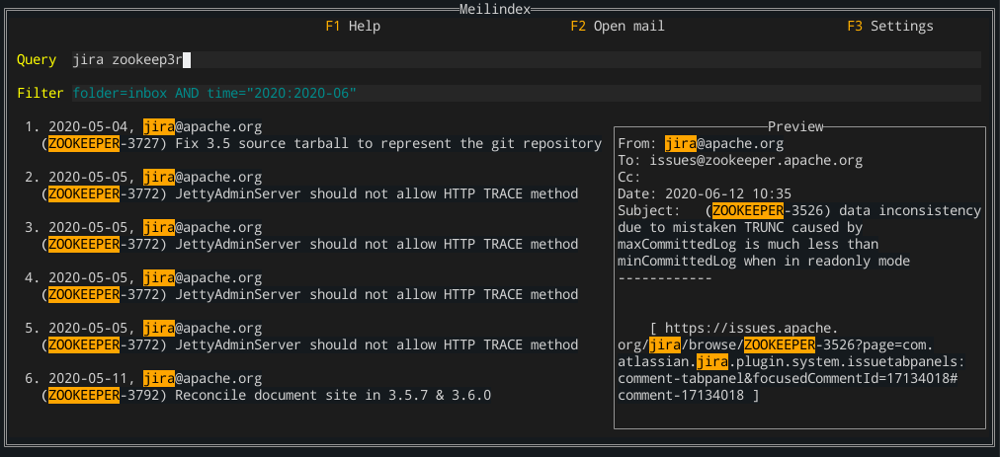

# Meilindex

[](LICENSE)
[](https://pkg.go.dev/tryffel.net/go/meilindex?tab=overview)

Email indexing and extremely fast full-text-search with Meilisearch. Meilindex supports configuring 
stop-words, ranking and synonyms. These are highly user-specific customizations and should be configured 
for more relevant search results. 

Licensed under AGPL-3.



## Features:
* Index mail from Imap or Mbox-file (tested with Thunderbird), store to Meilisearch
* Multiple configurations for different mailboxes
* Configure Meilisearch: stop words, ranking rules order
* Query Meilisearch instance either with CLI or with terminal gui
* Open selected mail in Thunderbird

Default config file: ~/meilindex.yaml

# Build
```
go get tryffel.net/go/meilindex
```

# Run
1: Make sure Meilisearch is running and accessible (tested with versions 0.12 - 0.18).
try with e.g. ```curl http://localhost:7700```

2: Create & fill config file

```
meilindex
```
This should create new config file, which is by default at ~/.meilindex.yaml
You can always override config file with '--config'.
Edit config file to suit your needs, insert at least imap and meilisearch settings.
All configuration file variables can be overridden with environment variables. Format is:
MEILINDEX_<block>_<key>, e.g. MEILINDEX_MEILISEARCH_URL for meilisearch.url.

3: (Optional) Customize Meilisearch index before parsing emails, see below

4: Index mail

A) Index mail from local Mbox file(s)
```
meilindex index dir /home/me/.thunderbird/my-profile/ImapMail/my-mail.com
# OR 
meilindex index file /home/me/.thunderbird/my-profile/ImapMail/my-mail.com/INBOX
```

B) Index mail from imap
```
# index INBOX
meilindex index imap 

# index any other folder, e.g. Archive
meilindex index imap --folder Archive
```

If you get following error during indexing:
```
index mails: push xxx emails: expected status: [202], got status: 413: Payload to large
```
then you need to increase max http body size for Meilisearch with flag: '--http-payload-size-limit'.

Due to parsing library used with Mbox files, parsing email sometimes fails, resulting in warning
starting with '(skip)', e.g. '(skip) read message attachment'. Just ignore these for now. Some parts of the email
may be inaccurate due to these errors: date, attachments, plain text body.


5: Query with cli
```
meilindex query my message
meilindex query --folder inbox --subject "item received" my message

```

6: Terminal ui for viewing & queying mail
Meilindex ships with simple Cli Gui for searching & viewing emails. Open it with:
```
meilindex
```

Query can be anything, filter is of format 'field=value' or 'field="value"'. Logical operators are supported. See
Meilisearch docs for more info. Filters must match exactly the field (no full-text-search, case-insensitive). 
Example filters:
```
folder=inbox AND from="example sender"
folder=inbox AND NOT from="example.sender@example.company"

# show everything in Jan 2020
time=2020-01-01:2020-01-31

# show everything in Feb or after
after=2020-02

# show everything before Feb
before=2020-02
```

Gui shortcuts:
* Move between tabs with TAB
* Move up/down list: Key-Up/Key-Down or J/K
* Enter mail with Enter
* Open selected mail in thunderbird with F2 (requires 'thunderlink' add-on)
* Close application with Ctrl-C

## Config

See ~/.meilindex.yaml.

For periodic background indexing, just run indexing command with e.g. cron.


# Customize Meilisearch index
Meilisearch features various optimizations and customizations for tailoring search results, 
see [docs](https://docs.meilisearch.com/references/settings.html) for more info. Meilindex supports 
modifying some of them, which hopefully makes the search experience better.

**Note** Meilisearch upgrade invalidates its database (at least before stable release). 
It is up to user to upgrade database with Meilisearch Dump, or re-create it by deleting Meilisearch database
before indexing mails with Meilindex.

## Stop words
Stop words are irrelevant words in regard to searching content. 
You can create custom stop word lists and let Meilindex 
push them to Meilisearch. Assets-directory contains some example files for stop word lists. These files were 
produced from NLTK language database. You can enable them by calling:
```
# View current stop words
meilindex settings stopwords get

# Push new stop word list
meilindex settings stopwords set assets/stopwords-en.json
```
Do note that only one list (file) can be enabled at a time. If you want to use multiple files, 
you need to combine the stop_word lists into a single file, for now.

## Ranking rules
Ranking is based on a set of rules. Meilisearch provides default set, which you can change to see more relevant
messages first. Creating new rules is not supported yet. See asset/ranking-default.json for format.

```
# View current rules
meilindex settings ranking get

# Reorder rules
meilindex settings ranking set assets/ranking-default.json
```

## Synonyms
Currently Meilindex supports pushing one-way synonyms, and it is up to user to create multiple-way mappings. Synonyms 
are also highly personal / context / language specific, so user should try to use this as their advantage.
Example synonyms mapping is found in assets/synonyms-example.json.

```
# view synonyms
meilindex settings synonyms (get)

# set synonyms
meilindex settings synonyms set assets/synonyms-default.json
```
